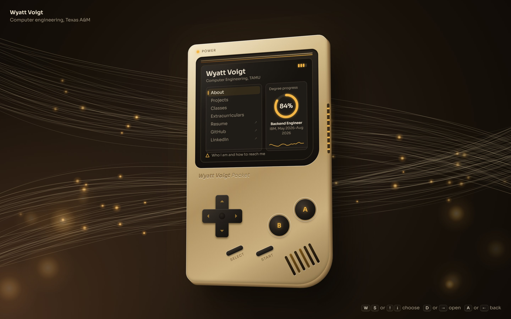
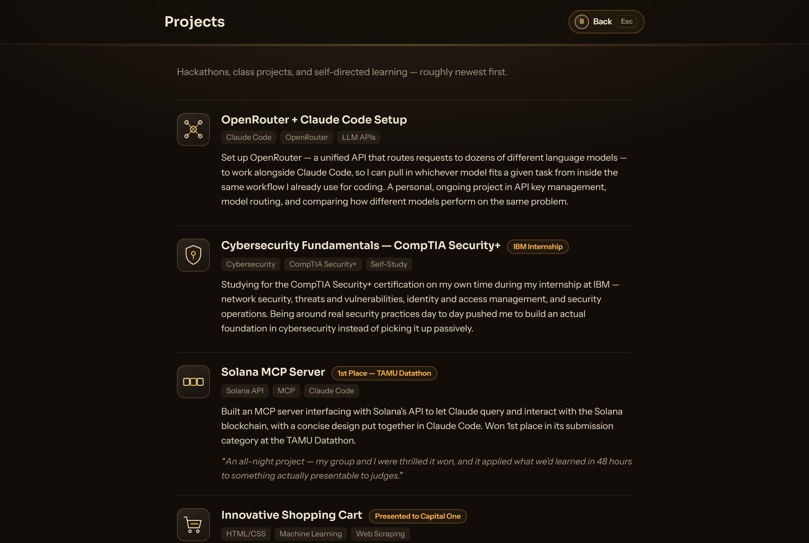
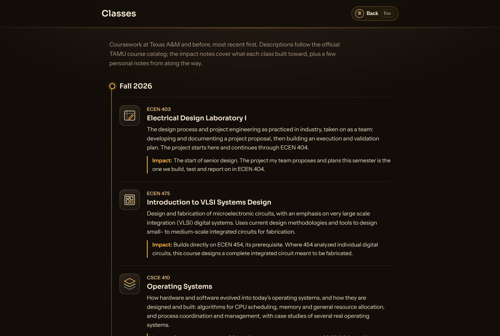
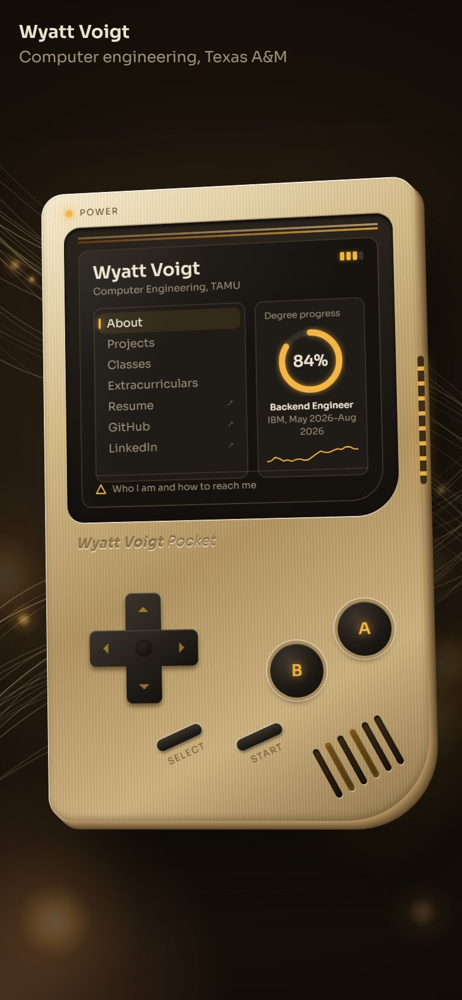

<h1 align="center">Wyatt Voigt — Personal Website</h1>

<p align="center">
  A portfolio you play like a Game Boy.<br>
  Computer Engineering at Texas A&amp;M, class of 2027.
</p>

<p align="center">
  <a href="https://wyattvo.github.io/personalWebsite/"><b>Live site</b></a> &nbsp;·&nbsp;
  <a href="https://people.tamu.edu/~wyatt.voigt/">TAMU mirror</a> &nbsp;·&nbsp;
  <a href="https://www.linkedin.com/in/wyatt-voigt-b72920385/">LinkedIn</a> &nbsp;·&nbsp;
  <a href="resume.pdf">Resume</a>
</p>

<p align="center">
  
</p>

## What it is

The whole site lives on the screen of a handheld console. Pick a section with the D-pad and it
opens out of the screen into a full page. Close it and it shrinks back into the Game Boy.

The look takes the shape of the original Game Boy (I restore retro consoles as a hobby) and
re-imagines it as a brushed champagne-gold device with a dark glass display, set against
animated amber fiber-optic light.

<table>
  <tr>
    <td width="50%"></td>
    <td width="50%"></td>
  </tr>
  <tr>
    <td align="center"><sub>Projects: hackathon wins and things I've built</sub></td>
    <td align="center"><sub>Classes: every semester on a timeline</sub></td>
  </tr>
</table>

<p align="center">
  <br>
  <sub>Scales down to fit a phone, and the on-screen buttons are tappable.</sub>
</p>

## Controls

| Action | Keyboard | On the Game Boy |
| --- | --- | --- |
| Move through the menu | <kbd>W</kbd> <kbd>S</kbd> or <kbd>↑</kbd> <kbd>↓</kbd> | D-pad up / down |
| Open a section | <kbd>D</kbd>, <kbd>→</kbd>, <kbd>Enter</kbd> or <kbd>Space</kbd> | **A**, **Start** or D-pad right |
| Go back | <kbd>A</kbd>, <kbd>←</kbd>, <kbd>Esc</kbd> or <kbd>B</kbd> | **B** or D-pad left |
| Scroll an open section | <kbd>W</kbd> <kbd>S</kbd> or <kbd>↑</kbd> <kbd>↓</kbd> | — |

You can also just click or tap the menu items.

## What's on the screen

- **Menu**: About, Projects, Classes and Extracurriculars open inside the site. Resume, GitHub
  and LinkedIn open in a new tab and are marked with ↗.
- **Degree progress**: a live percentage from Fall 2023 to graduation in May 2027, calculated
  from today's date.
- **Latest role**: read from [`resume-data.js`](resume-data.js), which also drives the
  "Now loading" boot screen.
- **Hint line**: a one-line description of whichever menu item is selected.

## The redesign

The first version was a flat, green-screen SVG Game Boy. This version keeps everything that made
it fun (the console, the menu and the D-pad) and rebuilds how it looks and works:

- **The device** is built in HTML and CSS instead of one big SVG. It has a brushed-metal finish,
  a real 3D shell edge, a three-quarter turn (like a book held in your hand) that follows your
  mouse, the classic twin stripe above the screen, a speaker grille and a glowing port on the side.
- **The background** is a `<canvas>` of gold Matrix-style digital rain: falling columns of bits,
  hex and katakana in two depth layers, under faint CRT scanlines.
- **The section pages** share one stylesheet, [`detail.css`](detail.css), with a dark-and-gold
  theme. Classes are shown on a timeline because the semesters really are a sequence.
- **The icons** are one hand-drawn set: 41 SVGs in the same gold line style, replacing a mix of
  clip art and stock photos.
- **The class content** is checked against the official
  [TAMU course catalog](https://catalog.tamu.edu/undergraduate/course-descriptions/). Each
  impact note says what the class led to, such as which later courses it's a prerequisite for.
- **Controls** now support WASD and all four arrow keys, plus a working left and right on the
  D-pad.
- **Accessibility**: keyboard focus is visible, buttons have labels, and the animations turn off
  when your system is set to reduce motion.

## Project structure

```
index.html              The Game Boy: menu, boot screen, controls and fiber background
detail.css              Shared theme for the section pages
about.html              Section pages that open inside the screen
projects.html
classes.html
extracurriculars.html
resume-data.js          Latest role, shown on the boot screen and the home screen
resume.pdf
images/                 Headshot plus the icon set (classes/, projects/, extracurriculars/)
docs/screenshots/       Images used in this README
serve.ps1               Tiny local web server for Windows
```

It's plain HTML, CSS and JavaScript: no frameworks, no build step and no dependencies besides
two Google Fonts (Sora and Instrument Sans).

## Run it locally

Open the site through a local web server rather than double-clicking `index.html`. The section
pages talk to the main page to close themselves, and browsers block that for files opened
straight from disk.

On Windows, from the repo folder:

```powershell
powershell -ExecutionPolicy Bypass -File serve.ps1
```

Then go to <http://localhost:8765>. Any static server works too, for example
`python -m http.server` or the VS Code Live Server extension.

## Updating content

- **New job or internship**: add it to the top of the list in [`resume-data.js`](resume-data.js).
- **New class, project or activity**: copy an existing `<article>` block in the matching page
  and point its `` at an icon in `images/`.
- **New icon**: icons are 48×48 SVGs drawn with a `#ead7ab` stroke and one `#f3b544` accent.
  Copy any file in `images/classes/` as a starting point.

## Hosting

The site is served by GitHub Pages from the `main` branch root, with a copy on TAMU's
people.tamu.edu hosting.
